## Basic Injection: Easy

**Description:** See if you can leak the whole database using what you know about SQL Injections. [link](https://web.ctflearn.com/web4/)

The challenge provided the original SQL query that shows the result, which was `SELECT * FROM webfour.webfour where name = '$input'`. This query takes the user's input and checks it in its database for a matching name.

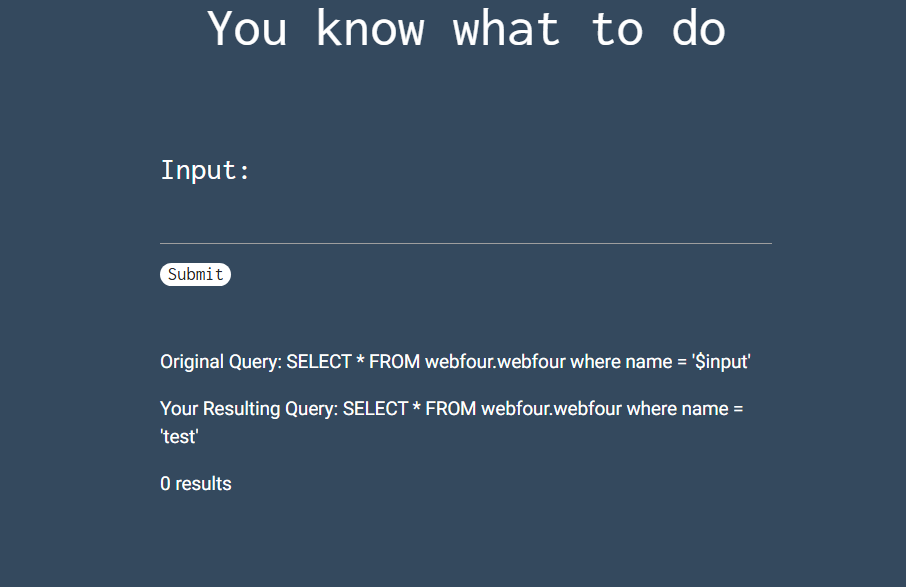

So, I tried injecting `' OR '1' = '1` and it dumped the database, showing the flag!

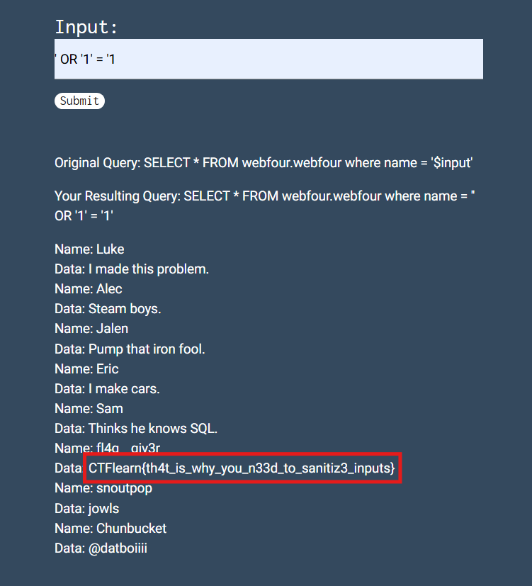

---

## POST Practice: Medium

**Description:** This website requires authentication, via POST. However, it seems as if someone has defaced our site. Maybe there is still some way to authenticate?  
http://165.227.106.113/post.php

After checking the website, I found some credentials in the source code

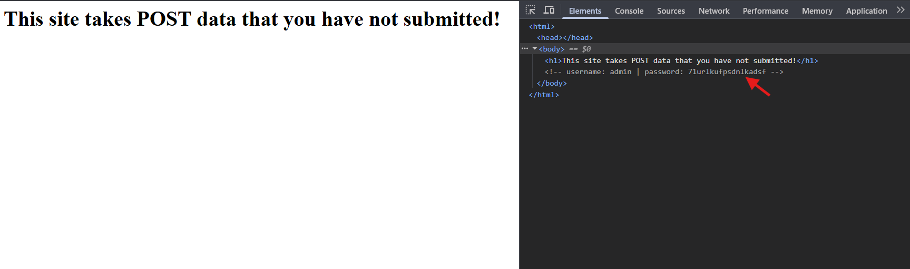

So my first thought was sending a post request using `curl`:

```bash
curl -X POST http://165.227.106.113/post.php -d "username=admin&password=71urlkufpsdnlkadsf"
````

and got the flag!

```
<h1>flag{p0st_d4t4_4ll_d4y}</h1>
```

Another approach would be sending a POST request with the provided credentials by burpsuite and the flag will appear

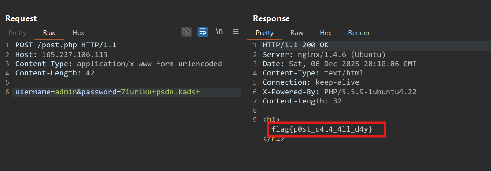

---

## Don't Bump Your Head(er): Medium

**Description:** Try to bypass my security measure on this site!
[http://165.227.106.113/header.php](http://165.227.106.113/header.php)

I noticed that the challenge involved headers as its name indicates, so I sent a GET request using burp as my first step

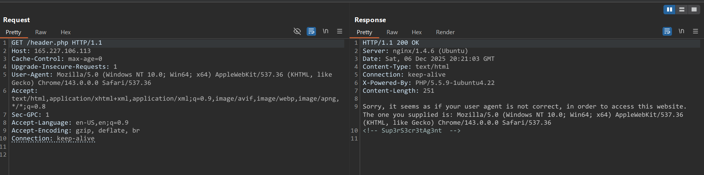

Then I noticed the comment `<!-- Sup3rS3cr3tAg3nt -->`, which could be the agent that the challenge accepts. So I sent another request, changing the **User-Agent** to `Sup3rS3cr3tAg3nt`

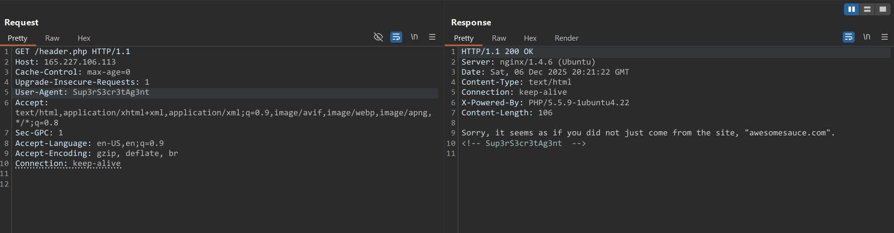

And it worked! but it still needed to be "accessed" from **awesomesauce.com**, which made me think of referring to it by adding:
`Referer: awesomesauce.com` to the header

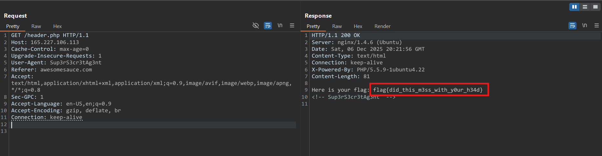

And we got our flag!

---

## Calculat3 M3: Hard

**Description:** Here! [http://web.ctflearn.com/web7/](http://web.ctflearn.com/web7/) I forget how we were doing those calculations, but something tells me it was pretty insecure.

The challenge was a simple calculator that its input field seemed vulnerable, So I intercepted the calculating GET request by burp, then sent it to the repeater

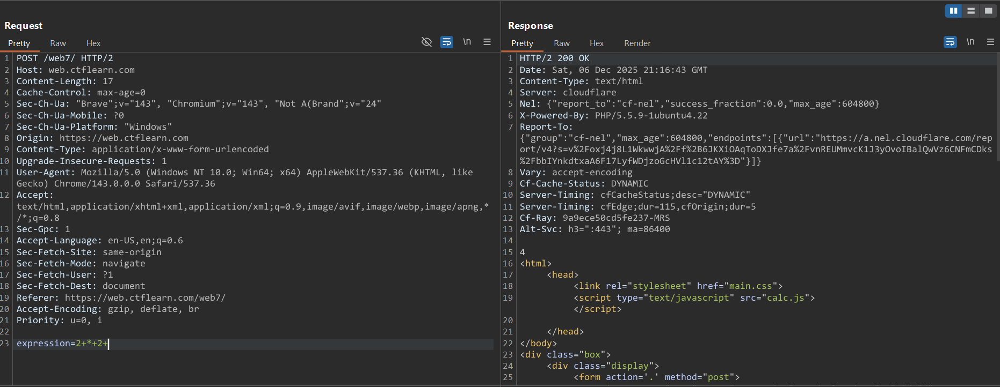

I thought of changing the value of `expression` to `;ls`, to check for command-injection

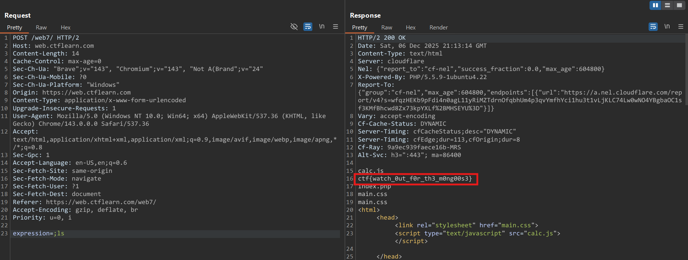

And it actually worked :>

---

## Inj3ction Time: Hard

**Description:** I stumbled upon this website: [http://web.ctflearn.com/web8/](http://web.ctflearn.com/web8/) 
and I think they have the flag in there somewhere. UNION might be a helpful command

The website looked similar to the `Basic injection`'s website.. It asks for an id then shows some info about dogs

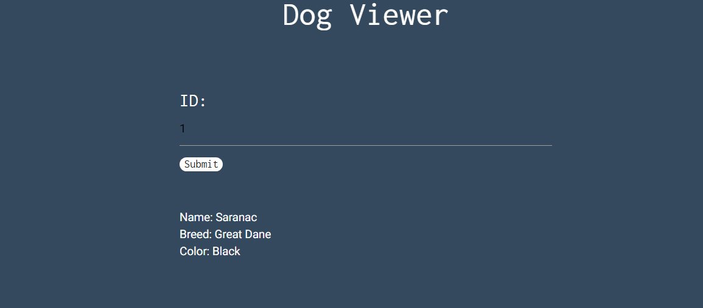

I noticed that it only accepts numbers from 1 to 3, and no other characters, so even though it's an SQLi challenge it doesn't show an error when entering quotes. However, a UNION attack may be used as the challenge description hints.

So, after some testing NULL values with UNION SELECT I found that **we have 4 columns**

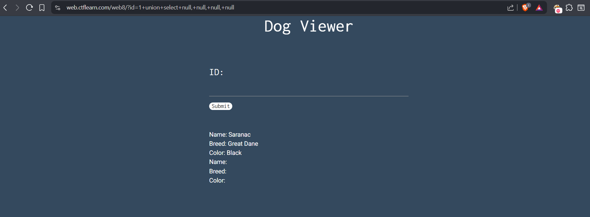

Then I checked which columns are vulnerable

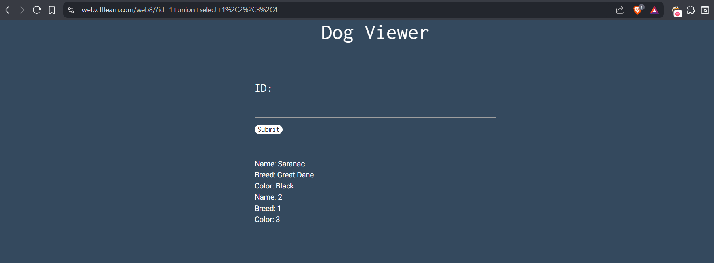

After that I checked the available tables by querying `table_name` from `information_schema.tables`


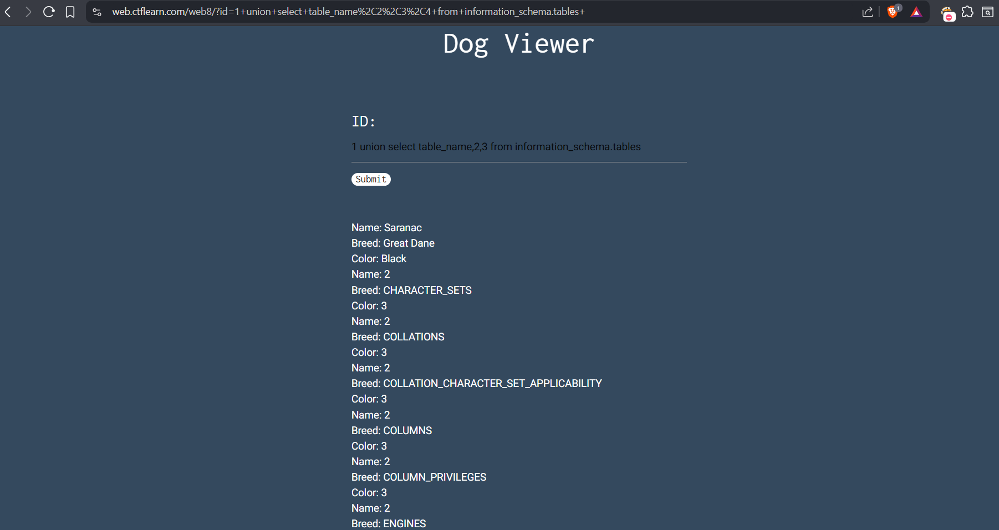

I scrolled down a bit till I noticed an interesting table: `w0w_y0u_f0und_m3`.

Then I checked the available columns by querying `column_name` from `information_schema.columns`


And after scrolling down again, I noticed an interesting column name: `f0und_m3`.

Now as we have the column and table names, our final query should be:

```
1 union select f0und_m3,2,3,4 from w0w_y0u_f0und_m3
```

Which worked!

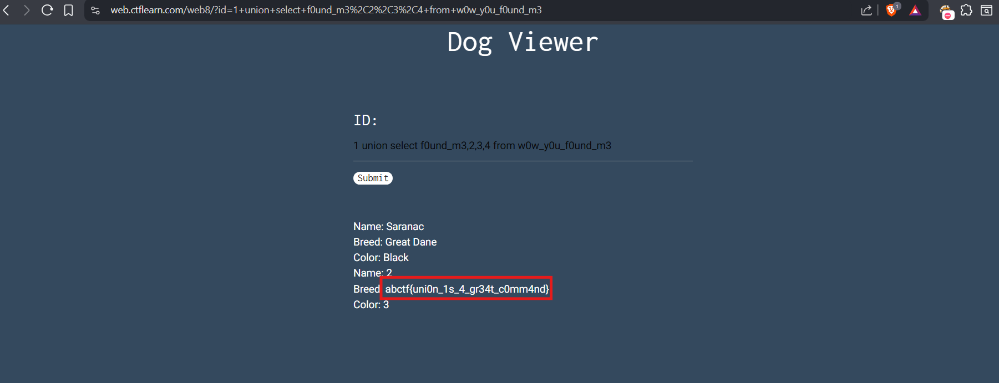

---
Alright, those were all the challenges I managed to solve. The other challenges are either down, or I still haven't tried them yet. Stay tuned for more write-ups! :)
